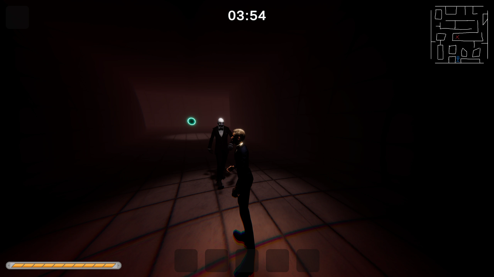

# 歪ノ夢路

## 概要

**歪ノ夢路** は、暗く歪んだ悪夢世界を探索する一人称ホラーアクションゲームです。
ランダムに発生する脅威や環境変化、視界を覆う演出がプレイヤーの恐怖心を刺激します。
シンプルな操作ながら、常に追われる緊張感と独特の世界観を体験できます。

---

## 特徴

* **一人称視点の没入感あるホラー体験**
* **バンパイアとゾンビを掛け合わせた怪異** が追跡
* ダメージに応じて画面が歪む **ビネット式体力表現**
* シンプルな操作で遊べるミニホラーゲーム
* Unity 6 を使用して開発

---

## 操作方法

* **WASD**：移動
* **マウス**：視点操作
* **Shift**：走る
* **Space**：ジャンプ
<!-- * **E**：調べる / インタラクト -->

---

## インストール方法

1. リリースページから最新のビルドをダウンロード
2. インストールする
3. 実行ファイル（.exe）を起動するだけでプレイ可能

---

## 開発情報

* 開発エンジン：Unity 6000.2.0f1
* 製作者：シンとチーム
* ジャンル：ホラー / アクション / 短編作品
